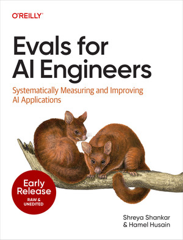

# Hi, I'm Hamel

I'm an ML engineer and independent consultant at [Parlance Labs](https://parlance-labs.com). I spend most of my time helping teams build AI products. Previously, I did applied ML at GitHub and Airbnb.

## What I'm working on

I'm working to bring data science back to AI: helping teams debug, analyze, and measure their systems. I call this "evals," and after doing it across 35+ AI products, I co-authored [Evals for AI Engineers](https://www.oreilly.com/library/view/evals-for-ai/9798341660717/) (O'Reilly), covering error analysis, LLM-as-a-judge, synthetic data, production monitoring, and building data flywheels. I also co-teach a [course on evals](https://maven.com/parlance-labs/evals?promoCode=evals-info-url) on Maven.

I write about what I learn at **[hamel.dev](https://hamel.dev)**. Some recent posts:

<!-- BLOG-POST-LIST:START -->
| Date | Post |
| --- | --- |
| Mar 2026 | [**The Revenge of the Data Scientist**](https://hamel.dev/blog/posts/revenge/) |
| Mar 2026 | [**Evals Skills for Coding Agents**](https://hamel.dev/blog/posts/evals-skills/) |
| Jan 2026 | [**LLM Evals: Everything You Need to Know**](https://hamel.dev/blog/posts/evals-faq/) |
| Jul 2025 | [**Stop Saying RAG Is Dead**](https://hamel.dev/) |
| Mar 2025 | [**A Field Guide to Rapidly Improving AI Products**](https://hamel.dev/blog/posts/field-guide/) |
| Dec 2024 | [**nbsanity - Share Notebooks as Polished Web Pages in Seconds**](https://hamel.dev/) |
| Nov 2024 | [**Building an Audience Through Technical Writing: Strategies and Mistakes**](https://hamel.dev/blog/posts/audience/) |
| Oct 2024 | [**Using LLM-as-a-Judge For Evaluation: A Complete Guide**](https://hamel.dev/blog/posts/llm-judge/) |
| Oct 2024 | [**Concurrency Foundations For FastHTML**](https://hamel.dev/) |
| Jul 2024 | [**An Open Course on LLMs, Led by Practitioners**](https://hamel.dev/blog/posts/course/) |
<!-- BLOG-POST-LIST:END -->

## Open source

I've contributed to tools across ML infrastructure, developer experience, and data science workflows. [Full list here](https://hamel.dev/oss/opensource.html).
